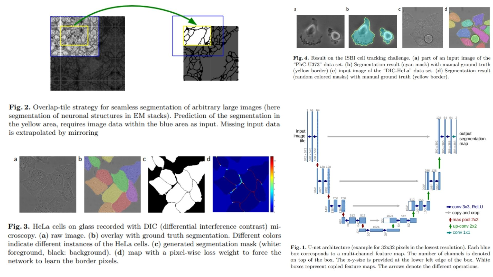

# ❄️ U-Net Replicating

This repository contains a PyTorch replication of the **U-Net: Convolutional Networks for Biomedical Image Segmentation** model. The goal is to reproduce the **U-Net architecture** for accurate pixel-wise biomedical image segmentation.

> ⚠️ Note: Elastic deformation is **not included** in the augmentation. Only rotation and shift are implemented.

- Only the **original U-Net configuration** is fully implemented.  
- The network consists of a **contracting path (encoder)**, a **bottleneck**, and an **expansive path (decoder)** with skip connections (mirroring) to preserve spatial details.  
- The implementation uses 3×3 convolutions, ReLU activations, max pooling, and 2×2 up-convolutions.  

**Paper:** [U-Net: Convolutional Networks for Biomedical Image Segmentation (MICCAI 2015)](https://arxiv.org/abs/1505.04597)

---


## 🖼 Overview – U-Net Architecture

  
*Figure:* U‑Net architecture showing **contracting path (encoder)**, **bottleneck**, **expansive path (decoder)**, and skip connections for precise pixel-wise segmentation.

- **Contracting Path (Encoder):** Reduces spatial size while increasing feature channels. Each block: 3×3 Conv → ReLU → 3×3 Conv → ReLU → MaxPool.  
- **Bottleneck:** Compresses deepest feature maps (smallest spatial size, highest channels) before expansion.  
- **Expansive Path (Decoder):** Upsamples features, concatenates with corresponding encoder outputs (skip connections), applies conv blocks.  
- **Final Layer:** 1×1 Conv maps features to the number of segmentation classes.  
- **Key Idea:** Skip connections preserve spatial details, allowing precise segmentation even in deep networks.

---

### 🔑 Key Formulas

1. **Convolutional Layer (ConvBlock):**  

$$y = f(W * x + b)$$

- Standard 3×3 convolution, ReLU activation.

2. **Up-Convolution (Decoder):**  

$$y_\text{up} = \text{Conv2d}(\text{Upsample}(x_\text{prev}) \oplus x_\text{skip})$$

- Upsample previous feature map, concatenate with encoder feature map, apply conv block.

3. **Final Pixel-wise Prediction:**  

$$\hat{y}_{i,j,c} = \text{softmax}(y_{i,j,c})$$

- For each pixel $(i,j)$, outputs class probabilities $c$.

---

## 🏗 Project Structure

```bash
U-Net-Replicating/
│
├── models/
│   ├── unet.py
│   ├── conv_block.py
│   ├── upconv_block.py
│   └── init_weights.py
│
├── training_utils/
│   ├── augmentation.py
│   ├── loss.py
│   └── optimizer.py
│
├── configs/
│   └── config.py
│
├── scripts/
│   └── preprocess_dataset.py
│
├── images/
│   └── figmix.jpg
│
├── requirements.txt
└── README.md

```

---

## 🔗 Feedback

For questions or feedback, contact: [barkin.adiguzel@gmail.com](mailto:barkin.adiguzel@gmail.com)


